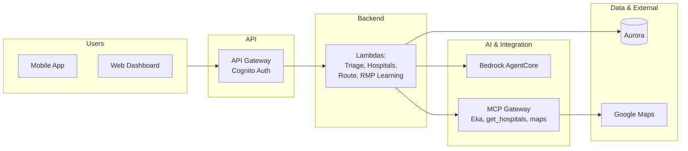
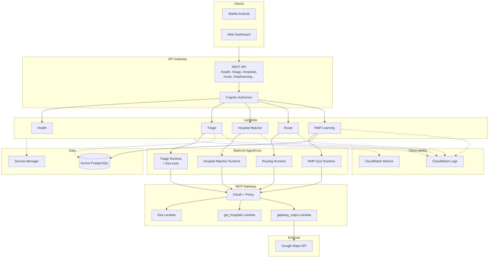

# Architecture — Detailed Document & Diagram Prompts

**Purpose:** Submission-ready architecture description and copy-paste prompts for generating architecture diagrams (for PPT, report, or diagram tools).  
**System:** Emergency Medical Triage and Hospital Routing System — AI-powered platform for rural India.

---

## 1. Overview

### Problem

In rural India, **68% of healthcare providers are unqualified RMPs** (Rural Medical Practitioners) with no formal training, yet they serve **70% of the population**. During emergencies they lack reliable severity assessment, knowledge of hospital capacity and specialists, access to Indian drug brands and treatment protocols at point of care, and safe triage decisions in the “golden hour.”

### Solution

We **augment RMPs** (not replace them) with:

- **AI triage** — Symptom and vital-sign analysis with **Eka Care** integration (Indian medications and treatment protocols in recommendations).
- **Hospital matching** — Real-time capability and capacity via MCP Gateway (get_hospitals).
- **Intelligent routing** — Real driving distance, duration, and Google Maps directions (POST /route).
- **RMP Learning** — Quiz flow (get question → submit answer → points, leaderboard) for continuous skill building.
- **Single-session flow** — Triage → Hospitals → Route with optional `session_id` for continuity.

### Users

- **RMPs / healthcare workers** — Mobile app, web dashboard; triage, hospital match, route, learning.
- **Hospital staff** — Capacity, handoff reports (planned).
- **Admins** — Config, audit (planned).

---

## 2. As-Built Architecture (What We Implemented)

### High-level flow

```
[RMP App (Web / Android)]
    → API Gateway (Cognito authorizer)
    → Lambdas: Health, Triage, Hospitals, Route, RMP Learning
    → AgentCore runtimes (Triage, Hospital Matcher, Routing, RMP Quiz)
    → MCP Gateway → Eka (Indian drugs/protocols), get_hospitals, get_route/maps
    → Aurora PostgreSQL (triage assessments, rmp_scores, learning_answers)
    → Google Maps (directions)
```

### Components

| Layer | Component | Responsibility |
|-------|-----------|----------------|
| **Client** | Web app (`frontend/web/`) | Next.js/Vite; triage form, hospitals, route, auth. |
| **Client** | Android app (`frontend/mobile-android/`) | Kotlin, Jetpack Compose; same flow, offline banner. |
| **API** | API Gateway (REST, regional) | Single entry; routes to Lambdas; Cognito authorizer for protected routes. |
| **API** | Endpoints | `GET /health`, `POST /triage`, `POST /hospitals`, `POST /route`, `POST /rmp/learning`, `GET /rmp/learning/me`, `GET /rmp/learning/leaderboard`. |
| **Compute** | Health Lambda | Liveness; no auth. |
| **Compute** | Triage Lambda | Receives symptoms/vitals; invokes **AgentCore Triage runtime**; runtime uses **Eka** tools via MCP Gateway (search_medications, search_protocols, get_protocol_publishers, search_pharmacology); returns severity, confidence, recommendations; optional session_id. |
| **Compute** | Hospital Matcher Lambda | Receives severity + recommendations; invokes **AgentCore Hospital Matcher runtime**; runtime calls **get_hospitals** via Gateway; optional patient location for distance/directions (get_route per hospital). |
| **Compute** | Route Lambda | Origin + destination; calls Gateway **maps/routing** target → gateway_maps Lambda → Google Maps; returns distance_km, duration_minutes, directions_url. |
| **Compute** | RMP Learning Lambda | POST: get_question or score_answer (invokes **AgentCore RMP Quiz runtime** + Eka); persists points to Aurora; GET /me and GET /leaderboard read from Aurora (rmp_scores). |
| **AI** | Bedrock AgentCore | Four runtimes: Triage (with Eka tools), Hospital Matcher (get_hospitals), Routing (get_route, get_directions), RMP Quiz (get_question, score_answer). |
| **Integration** | MCP Gateway | OAuth-secured; routes tool calls to Gateway Lambdas: Eka, get_hospitals, routing/maps. Policy engine (Cedar) allowlists tools. |
| **Integration** | Eka Care | Indian drug brands and treatment protocols; invoked via Gateway Lambda. |
| **Integration** | get_hospitals Lambda | Returns hospital list (synthetic or real); used by Hospital Matcher agent. |
| **Integration** | gateway_maps Lambda | Google Maps Routes API; directions for route and per-hospital directions. |
| **Data** | Aurora PostgreSQL | Serverless v2, private subnets, IAM auth; triage_assessments, hospital_matches, rmp_scores, learning_answers. |
| **Auth** | Cognito User Pools | RMP sign-in; Id Token in `Authorization: Bearer <token>`; API Gateway authorizer. |
| **Config** | Secrets Manager | api_config (API URL, Gateway Lambda ARNs), gateway-config (OAuth client), rds-config, bedrock-config; no hardcoded secrets. |
| **Observability** | CloudWatch Logs | Structured logs per Lambda (source, duration_ms, request_id); no PHI in log text; CloudWatch Logs Insights for trace and p99. See [OBSERVABILITY.md](backend/OBSERVABILITY.md). |
| **Policy** | AgentCore Policy (Cedar) | Attached to MCP Gateway via `scripts/setup_agentcore_policy.py`; allowlist of 8 tools (Eka, get_hospitals, get_route, get_directions, geocode_address); default deny. See [POLICY-RUNBOOK.md](backend/POLICY-RUNBOOK.md). |
| **Guardrails** | G1–G3 | Input validation (symptoms/vitals/age, severity enum, lat/lon); output validation (max lengths, enums); safety prompts in agents (do not prescribe, refusal for off-topic). See [AGENT-PROMPTS.md](backend/AGENT-PROMPTS.md). |
| **Compliance** | HIPAA H1–H4 | PHI scope documented; encryption at rest (Aurora, S3) and in transit; IAM least privilege, no PHI in logs; audit via request_id, triage_assessments.id, CloudWatch. See [HIPAA-Compliance-Checklist.md](backend/HIPAA-Compliance-Checklist.md). |

### Data flow (summary)

1. **Triage:** Client → API Gateway (Cognito) → Triage Lambda → AgentCore Triage runtime → Gateway → Eka (if Indian drugs/protocols requested) → structured response → Lambda → client (severity, recommendations, session_id).
2. **Hospitals:** Client → API Gateway → Hospital Matcher Lambda → AgentCore Hospital Matcher → Gateway → get_hospitals; optionally get_route per hospital for distance/directions → client (hospitals list, directions_url per hospital).
3. **Route:** Client → API Gateway → Route Lambda → Gateway (maps target) → gateway_maps Lambda → Google Maps → client (distance_km, duration_minutes, directions_url).
4. **RMP Learning:** Client → API Gateway → RMP Learning Lambda → (POST) AgentCore RMP Quiz + Aurora (persist points) or (GET) Aurora only (me/leaderboard) → client.

---

## 3. Prompts for Generating Architecture Diagrams

Use the following prompts with an image generator (e.g. DALL·E, Midjourney), diagram tool (draw.io, Lucidchart, PowerPoint), or Mermaid renderer to produce diagrams for submission.

**Naming rules (avoid common mistakes):** Use **RMP** (Rural Medical Practitioner), not HMP. Use **Route** or **Routing** for the directions flow, not "Acute". Use **RMP Learning** and **RMP Quiz** for the quiz/leaderboard feature.

---

### 3.1 High-level (executive) diagram prompt

**Copy-paste prompt:**

Create a clean, professional **high-level system architecture diagram** for the following application. Style: simple boxes and arrows, suitable for slides or a one-page overview. Show main layers and value flow only; no code or protocols.

**Application:** Emergency Medical Triage and Hospital Routing System — an AI-powered platform for rural India that helps **Rural Medical Practitioners (RMPs)** assess emergency severity, get Indian drug and protocol guidance (Eka Care), match patients to hospitals, and get turn-by-turn directions.

**Layers to show (left to right or top to bottom):**

1. **Users:** Mobile app (Android), Web dashboard. Label: RMPs / healthcare workers.
2. **Entry:** Single box — API Gateway with Cognito auth (label: "Cognito Authorizer" or "Cognito Auth").
3. **Backend:** One box — Backend services (Lambda): Health, Triage, Hospital Matcher, **Route**, **RMP Learning**. Do not use "Acute" or "HMP"; use "Route" and "RMP Learning".
4. **AI & integration:** One box — Bedrock AgentCore (four runtimes: Triage, Hospital Matcher, Routing, RMP Quiz) and MCP Gateway (policy-enforced; tools: Eka, get_hospitals, maps).
5. **Data & external:** One box — Aurora PostgreSQL, Secrets Manager; external: Google Maps, Eka Care Platform.

**Flow:** Users → API Gateway (Cognito) → Backend Lambdas → Bedrock AgentCore → MCP Gateway → tools → Aurora / Google Maps / Eka. Use short labels; no code. The diagram should answer: Where do users land? Where is app logic? Where is AI and data? What is external?

---

### 3.2 Detailed (technical) diagram prompt

**Copy-paste prompt:**

Create a **detailed technical architecture diagram** for the following system. Style: clear rectangles for components, labeled arrows for data/control flow. Suitable for a technical design doc or submission appendix. **Include an Observability section** (CloudWatch Logs and CloudWatch Metrics) as in item 8 below.

**System:** Emergency Medical Triage and Hospital Routing System (rural India). Augments **RMPs** (Rural Medical Practitioners) with AI triage (Eka: Indian drugs/protocols), hospital matching, routing (Google Maps), and **RMP Learning** (quiz, leaderboard). **Use exact names:** RMP (not HMP), Route (not Acute), RMP Learning, RMP Quiz.

**Components to include:**

**1. Clients:** Mobile app (Android), Web dashboard. Both use Cognito Id Token for API calls.

**2. API layer:** API Gateway (REST, regional). **Cognito Authorizer** connected to API Gateway. Endpoints: GET /health, POST /triage, POST /hospitals, POST /route, POST /rmp/learning, GET /rmp/learning/me, GET /rmp/learning/leaderboard. Cognito authorizer on all except /health.

**3. Backend (Lambdas) — exactly five:** Health Lambda; Triage Lambda (invokes AgentCore Triage runtime); Hospital Matcher Lambda (invokes AgentCore Hospital Matcher runtime); **Route Lambda** (calls Gateway maps target); **RMP Learning Lambda** (invokes AgentCore RMP Quiz runtime, reads/writes Aurora). All use IAM roles; config from Secrets Manager.

**4. AI:** Amazon Bedrock AgentCore. Four runtimes: Triage (Eka tools via Gateway), Hospital Matcher (get_hospitals via Gateway), Routing (get_route, get_directions), RMP Quiz (get_question, score_answer). Show as one “Bedrock AgentCore” box with note “Triage, Hospital Matcher, Routing, RMP Quiz runtimes”.

**5. Tool gateway:** **MCP Gateway** — OAuth-secured; **Cedar policy** allowlists tools. Three tool Lambdas: **Eka Care Tool**, **get_hospitals Tool**, **gateway_maps Tool** (→ Google Maps). Arrows: AgentCore runtimes → MCP Gateway → Eka / get_hospitals / gateway_maps.

**6. Data layer:** **Aurora PostgreSQL** (Serverless v2, IAM auth): triage_assessments, hospital_matches, rmp_scores, learning_answers. **Secrets Manager**: api_config, gateway-config, rds-config. Show dashed lines from Lambdas and tools to Secrets Manager for config.

**7. External:** Google Maps API (directions). Eka Care Platform (via Eka Care Tool).

**8. Observability (required):** Dedicated section with **CloudWatch Logs** and **CloudWatch Metrics**. Show dashed arrows from Triage, Hospital Matcher, Route, and RMP Learning Lambdas (and optionally gateway tool Lambdas) to CloudWatch. Label as Observability or Monitoring.

**Flow:** Clients → API Gateway → Cognito Authorizer → Lambdas; Triage/Hospital Matcher/RMP Quiz/Route Lambdas → AgentCore runtimes → MCP Gateway → Eka / get_hospitals / gateway_maps; Route Lambda → Gateway → gateway_maps → Google Maps; RMP Learning Lambda and Triage Lambda → Aurora; Lambdas → Secrets Manager; Lambdas and tools → CloudWatch. Use short labels. No code snippets.

---

### 3.3 Submission-ready diagram checklist

Before finalizing any diagram, verify it includes:

| Category | Items to show |
|----------|----------------|
| **Clients** | Mobile App (Android), Web Dashboard; label "RMPs" or "healthcare workers". |
| **Auth** | API Gateway, **Cognito Authorizer** (or Cognito Auth). |
| **Lambdas (5)** | Health, Triage, Hospital Matcher, **Route**, **RMP Learning** (not HMP, not Acute). |
| **AgentCore (4 runtimes)** | Triage, Hospital Matcher, Routing, **RMP Quiz**. |
| **Gateway** | **MCP Gateway** (optionally label "OAuth + Policy" or "Cedar policy"). |
| **Tools (3)** | Eka Care Tool, get_hospitals Tool, gateway_maps Tool. |
| **Data** | Aurora PostgreSQL, **Secrets Manager**. |
| **External** | Google Maps API, Eka Care Platform. |
| **Observability** | **CloudWatch Logs**, **CloudWatch Metrics**; dashed lines from Lambdas (and optionally tools) to them. |
| **Security (implicit)** | Cognito at API; Secrets Manager in data layer; MCP Gateway as policy boundary. |

**Common mistakes to avoid:** "HMP" → use **RMP**; "Acute Service" → use **Route** or **Routing**; missing Observability section; missing Secrets Manager; missing RMP Quiz runtime or RMP Learning Lambda.

---

## 4. Mermaid Diagrams (as-built)

### 4.1 High-level (flow)



### 4.2 Detailed (component-level)



---

## 5. Security and configuration

| Aspect | Implementation |
|--------|----------------|
| **Auth** | Cognito User Pools; Id Token in `Authorization: Bearer <token>`; API Gateway Cognito authorizer. |
| **Secrets** | Secrets Manager only; no .env or hardcoded keys in repo. api_config, gateway-config, rds-config, bedrock-config, rmp-test-credentials. |
| **IAM** | Lambda execution roles (managed identity); Bedrock, Secrets Manager, RDS IAM auth, AgentCore invoke. |
| **Network** | Aurora in private subnets; Lambda in VPC for RDS when needed; API Gateway public. |
| **Policy** | AgentCore Policy (Cedar) on MCP Gateway; allowlist of tools (get_hospitals, Eka tools, get_route, get_directions, geocode_address). Script: `scripts/setup_agentcore_policy.py`; ENFORCE or LOG_ONLY. See [POLICY-RUNBOOK.md](backend/POLICY-RUNBOOK.md). |
| **Guardrails** | G1 input validation (triage/hospitals/route), G2 output validation (max lengths, enums), G3 safety prompts in agent instructions (do not prescribe, refuse off-topic). [AGENT-PROMPTS.md](backend/AGENT-PROMPTS.md). |
| **Compliance** | HIPAA H1–H4 documented: PHI scope, encryption (Aurora/S3, TLS), access control (IAM scoped, no PHI in logs), audit (request_id, CloudWatch, triage_assessments.id). [HIPAA-Compliance-Checklist.md](backend/HIPAA-Compliance-Checklist.md). |

---

## 6. Observability and logging

| Aspect | Implementation |
|--------|----------------|
| **Logs** | Each Lambda (Triage, Hospital Matcher, Route, RMP Learning) emits structured logs: `source=` (agentcore/converse), `duration_ms=`, `request_id=` or `aws_request_id=`. No PHI in log message text. |
| **CloudWatch** | Lambda logs in CloudWatch Logs; use **CloudWatch Logs Insights** to query by source, duration, request_id. Example queries: count by source, p99 duration; trace review for medical audit. |
| **Trace / audit** | Use `request_id` (or `aws_request_id`) to correlate a request across log lines and with Aurora (`triage_assessments.request_id`). |
| **Dashboards** | CloudWatch dashboard with widgets for the above queries, or default Lambda metrics (Invocations, Duration, Errors). Bedrock AgentCore console for runtime spans when available. |

**Reference:** [OBSERVABILITY.md](backend/OBSERVABILITY.md).

---

## 7. References

| Document | Description |
|----------|-------------|
| [README.md](../README.md) | Project overview, quick start, Big 5 |
| [HACKATHON.md](../HACKATHON.md) | Submission summary, architecture snippet, quick start |
| [docs/backend/design.md](backend/design.md) | Full design (roles, components, data models) |
| [docs/backend/OBSERVABILITY.md](backend/OBSERVABILITY.md) | CloudWatch logs, trace, Logs Insights queries |
| [docs/backend/POLICY-RUNBOOK.md](backend/POLICY-RUNBOOK.md) | AgentCore Policy (Cedar), allowlist, setup script |
| [docs/backend/AGENT-PROMPTS.md](backend/AGENT-PROMPTS.md) | G3 safety prompts and guardrails |
| [docs/backend/HIPAA-Compliance-Checklist.md](backend/HIPAA-Compliance-Checklist.md) | H1–H4 PHI, encryption, access, audit |
| [docs/architecture/architecture-diagram-prompts.md](architecture/architecture-diagram-prompts.md) | Legacy diagram prompts (design-time) |
| [docs/openapi.yaml](openapi.yaml) | OpenAPI 3.0 spec for all endpoints |

---

## 8. How to use this document for submission

1. **PPT / report:** Use §1 (Overview) and §2 (As-Built Architecture) for narrative; use §3.1 or §3.2 prompts to generate a diagram, or paste the Mermaid from §4 into a Mermaid-supported tool (e.g. Mermaid Live Editor, GitHub README) and export as image.
2. **Diagram tools:** Copy-paste the prompt from §3.1 (high-level) or §3.2 (detailed) into your preferred diagram generator. Use §3.3 (checklist) before finalizing to ensure nothing is missing.
3. **Technical appendix:** Include §2 (Components table, Data flow), §4 (Mermaid), §5 (Security), §6 (Observability), and links to Policy/Guardrails/HIPAA runbooks as the architecture appendix.
