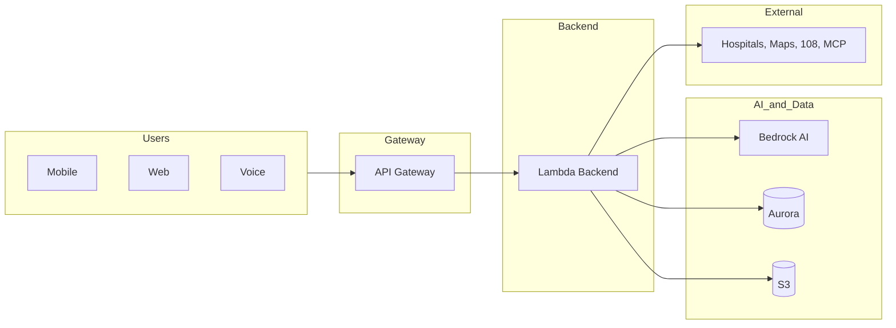
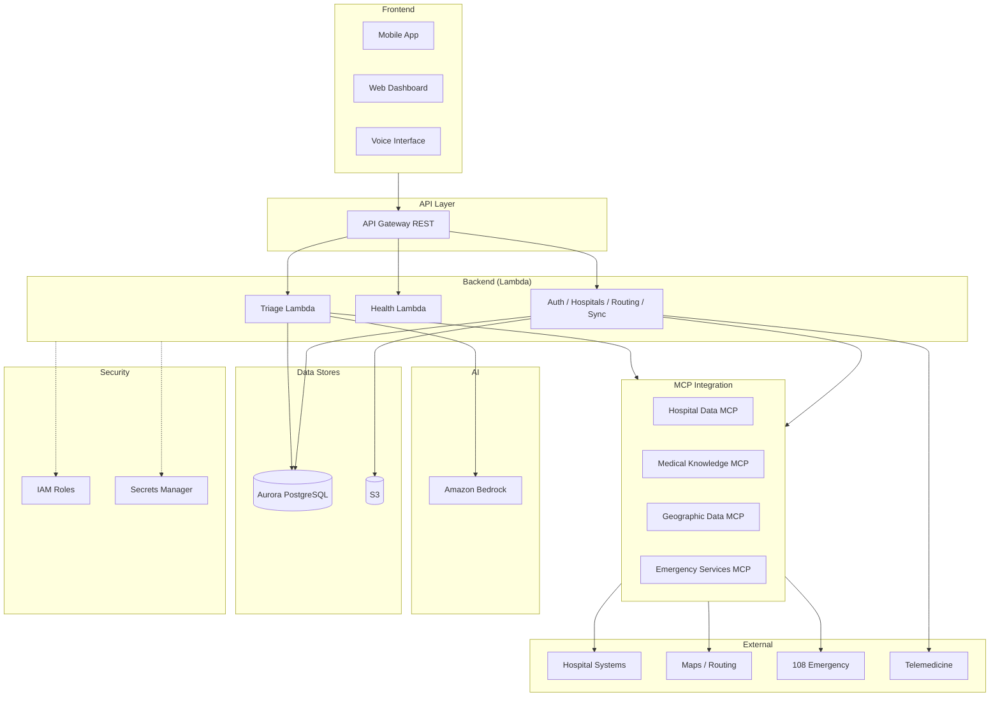

# Architecture Diagram Prompts — Emergency Medical Triage

Use these prompts with an image generator (e.g. DALL·E, Midjourney, or Cursor’s image tool) or adapt them for Mermaid/diagram tools to produce **high-level** and **detailed** architecture diagrams.

---

## Application approach (summary)

- **Purpose:** AI-powered emergency triage and hospital routing for rural India; augments unqualified RMPs (Rural Medical Practitioners) who handle ~68% of rural cases.
- **Users:** Healthcare workers/RMPs (mobile, voice, web), Hospital staff (capacity, handoff), Admins (config, analytics, audit).
- **Flow:** User captures patient info + symptoms + vitals → AI triage (Bedrock, multi-model consensus, safety guardrails) → severity + recommended actions → hospital matching (beds, specialists, distance) → routing/navigation → handoff report. Offline: cached triage (20 scenarios) + cached hospitals (50 km) + sync when back online.
- **Stack:** Frontend (Mobile, Web, Voice) → API Gateway → Lambda (Python triage + future services) → Bedrock (AI), Aurora PostgreSQL (persistence), S3 (logs/backups). MCP servers: Hospital Data, Medical Knowledge, Geographic Data, Emergency Services. Auth via IAM + Secrets Manager; no hardcoded credentials.

---

# 1. HIGH-LEVEL ARCHITECTURE DIAGRAM PROMPT

Use this for an **executive or overview** diagram (few boxes, clear value flow).

---

**Prompt — High-level architecture diagram**

Create a clean, professional **high-level system architecture diagram** for the following application. Style: simple boxes and arrows, suitable for slides or a one-page overview. Do not show every technical component; focus on the main layers and value flow.

**Application:** Emergency Medical Triage and Hospital Routing System — an AI-powered platform for rural India that helps healthcare workers and Rural Medical Practitioners (RMPs) assess emergency severity and route patients to the right hospitals.

**Show these layers only (left to right or top to bottom):**

1. **Users / touchpoints**
   - Mobile app (Android/iOS), Web dashboard, Voice interface.
   - Roles: Healthcare worker / RMP, Hospital staff, Admin.

2. **Entry / API**
   - Single box: “API Gateway” (all clients hit this).

3. **Application / backend**
   - One box: “Backend services (Lambda)” — triage, hospital matching, routing, auth, sync.

4. **AI & data**
   - One box: “AI (Amazon Bedrock)” — symptom and severity analysis.
   - One box: “Data” — database (Aurora PostgreSQL) and storage (S3).

5. **External / integrations**
   - One box: “External systems” — hospitals, maps/routing, emergency services (108), MCP data sources.

**Flow to show:** Users → API Gateway → Backend (Lambda) → AI (Bedrock) and Data (Aurora, S3); Backend also talks to External systems. Keep labels short; use at most 1–2 lines per box. No code, no ports, no protocols. The diagram should answer: “Where do users land, where is the app logic, where is AI and data, and what’s outside?”

---

**Mermaid alternative (high-level)**

---

# 2. DETAILED ARCHITECTURE DIAGRAM PROMPT

Use this for a **technical, component-level** diagram (developers and architects).

---

**Prompt — Detailed architecture diagram**

Create a **detailed technical architecture diagram** for the following system. Style: clear rectangles for components, labeled arrows for data/control flow. Include security and deployment boundaries where relevant. Suitable for a technical design doc or engineering wiki.

**System name:** Emergency Medical Triage and Hospital Routing System (rural India; augments RMPs with AI triage and hospital routing).

**Layers and components to include:**

**1. Client / frontend**
- Mobile app (Android/iOS), Web dashboard, Voice interface.
- Shared frontend modules: Auth, Triage UI, Hospital matching UI, Routing/navigation, RMP training, Peer network, Language (7 languages), Offline/cache.

**2. API and gateway**
- API Gateway (REST, regional).
- Endpoints (show as a small list or single “REST API” box): `/health`, `/triage`, and planned: `/auth/*`, `/hospitals/match`, `/routing/*`, `/rmp/*`, `/sync/*`, etc.

**3. Backend (compute)**
- Lambda functions (Python for triage; Node.js health today): Triage assess, Health check; (planned) Auth, Hospital matcher, Routing, RMP augmentation, Sync/offline upload.
- Show Lambda as one or two boxes (e.g. “Triage Lambda”, “API Lambdas”) with a note “IAM role, no keys; config from env + Secrets Manager”.

**4. AI**
- Amazon Bedrock (bedrock-runtime): multi-model consensus for severity (Critical/High/Medium/Low), confidence score; if confidence &lt; 85% → treat as high priority. Structured JSON in/out; handle ValidationException and AccessDeniedException.

**5. Data**
- Aurora PostgreSQL (Serverless v2): private subnets, IAM auth; triage results, reports, user/hospital data.
- S3: versioned, encrypted; audit logs, backups, media.
- (Design also references DynamoDB for real-time hospital data — show as optional or “future” if you want one diagram for current + planned.)

**6. MCP integration layer**
- Hospital Data MCP — real-time hospital info (beds, specialists, equipment).
- Medical Knowledge MCP — triage protocols, guidelines.
- Geographic Data MCP — routing, maps.
- Emergency Services MCP — ambulance/108 coordination.
- Show: Backend/Lambda calls MCP layer; MCP may call Bedrock or external systems. On MCP failure: graceful degradation, alert operators.

**7. External systems**
- Hospital systems (capacity, status).
- Maps/routing (e.g. Google Maps API or similar).
- 108 Emergency services.
- Telemedicine platforms (for RMP escalation).

**8. Security and config**
- IAM: Lambda execution roles (managed identity), no access keys in code.
- Secrets Manager: Bedrock config (region, model id), DB credentials, third-party keys.
- No .env or hardcoded secrets in repo.

**Flow to show (simplified):**
- Client → API Gateway → Lambda(s) → Bedrock for triage; Lambda → Aurora and S3; Lambda → MCP layer → external systems.
- Optional: VPC boundary around Lambda (if in VPC) and Aurora.

**Labels:** Use short technical names (e.g. “API Gateway”, “Triage Lambda”, “Bedrock”, “Aurora PostgreSQL”, “Hospital Data MCP”). One line per component is enough; add “(encrypted)” or “(IAM)” only where it helps. No code snippets in the diagram.

---

**Mermaid alternative (detailed)**

---

## How to use

- **High-level:** Paste the “High-level architecture diagram” prompt into an image generator, or use the high-level Mermaid in a Markdown viewer / Mermaid Live Editor.
- **Detailed:** Paste the “Detailed architecture diagram” prompt for a technical illustration, or use the detailed Mermaid for a component-level diagram.
- Adjust “Aurora only” vs “Aurora + DynamoDB” in the detailed prompt if your roadmap includes DynamoDB for real-time hospital data.
