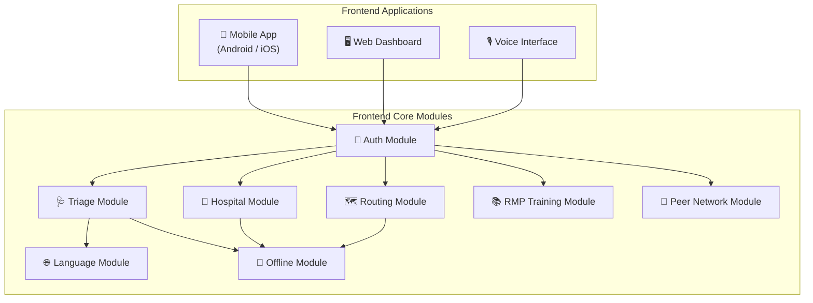
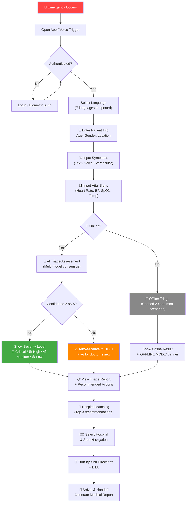
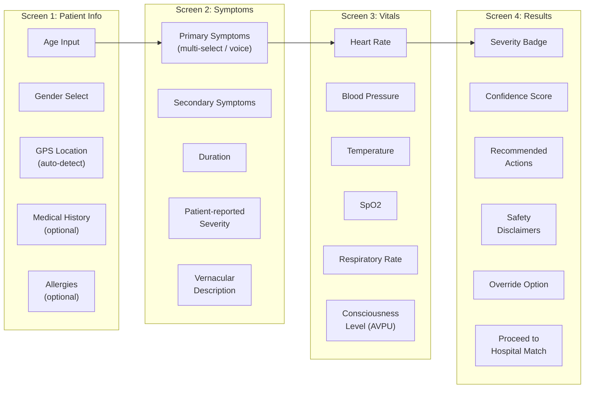
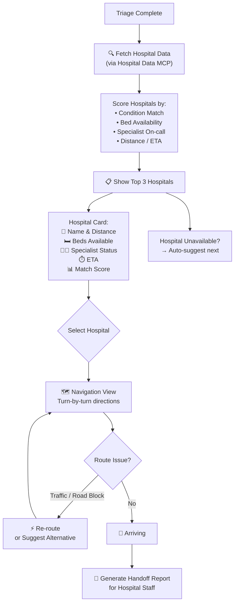
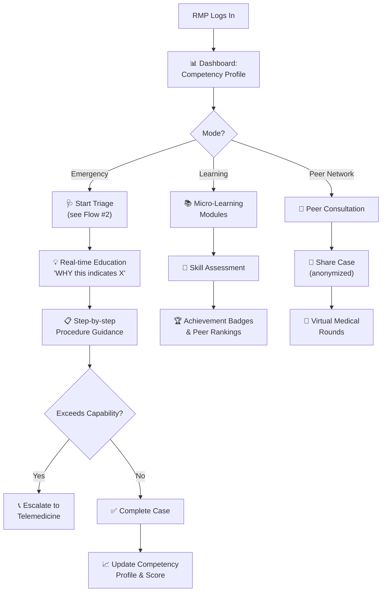
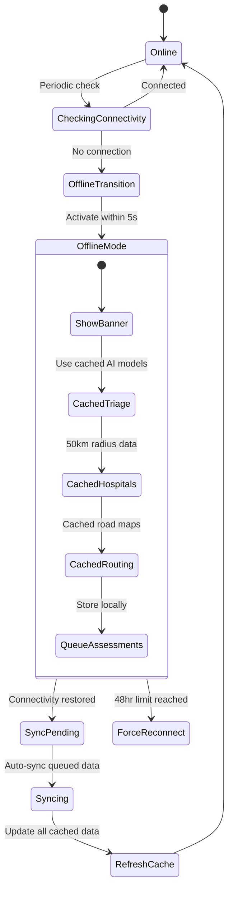
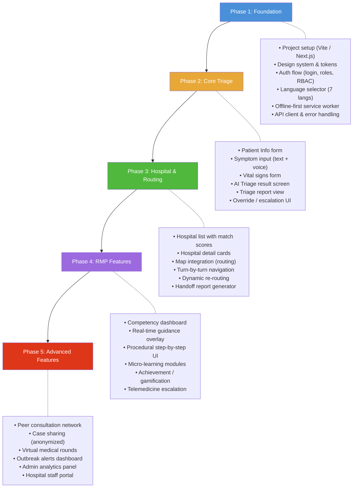

# Emergency Medical Triage — Frontend Workflow Diagram

## System Overview

The frontend serves **three user roles** (Healthcare Worker / RMP, Hospital Staff, Admin) across **three platforms** (Mobile App, Web Dashboard, Voice Interface). Below are the key workflow diagrams to guide frontend development.

---

## 1. High-Level Frontend Architecture

---

## 2. Primary User Flow — Emergency Triage & Routing

This is the **core workflow** an RMP/Healthcare Worker follows during an emergency.

---

## 3. Triage Assessment — Detailed Screen Flow

---

## 4. Hospital Matching & Routing Flow

---

## 5. RMP Augmentation & Training Flow

---

## 6. Offline Mode State Machine

---

## 7. Role-Based Screen Map

| Screen / Module | 🩺 RMP / Healthcare Worker | 🏥 Hospital Staff | 🔧 Admin |
|---|---|---|---|
| **Login / Auth** | ✅ | ✅ | ✅ |
| **Language Selection** | ✅ | ✅ | ✅ |
| **Triage Assessment** | ✅ | ❌ | ❌ |
| **Hospital Matching** | ✅ | ❌ | ❌ |
| **Route Navigation** | ✅ | ❌ | ❌ |
| **Real-time Guidance** | ✅ | ❌ | ❌ |
| **Training / Learning** | ✅ | ❌ | ❌ |
| **Peer Network** | ✅ | ❌ | ❌ |
| **Competency Dashboard** | ✅ | ❌ | ✅ (view all) |
| **Capacity Management** | ❌ | ✅ | ✅ |
| **Incoming Patient Alerts** | ❌ | ✅ | ❌ |
| **Handoff Reports** | ✅ (send) | ✅ (receive) | ✅ (audit) |
| **Analytics Dashboard** | ❌ | ❌ | ✅ |
| **User Management** | ❌ | ❌ | ✅ |
| **System Config / MCP** | ❌ | ❌ | ✅ |
| **Audit Logs** | ❌ | ❌ | ✅ |
| **Outbreak Alerts** | ✅ (view) | ✅ (view) | ✅ (manage) |

---

## 8. Recommended Frontend Build Order

---

## 9. API Endpoints the Frontend Will Consume

| Endpoint | Method | Purpose |
|---|---|---|
| `/auth/login` | POST | Authenticate user, return JWT |
| `/auth/validate` | GET | Validate token & role |
| `/triage/assess` | POST | Submit symptoms → get severity |
| `/triage/report/{id}` | GET | Fetch triage report |
| `/triage/override/{id}` | PUT | Override AI recommendation |
| `/hospitals/match` | POST | Get top 3 hospital matches |
| `/hospitals/{id}/status` | GET | Real-time hospital status |
| `/routing/calculate` | POST | Get route to hospital |
| `/routing/navigate/{id}` | GET | Turn-by-turn steps |
| `/rmp/profile/{id}` | GET | RMP competency profile |
| `/rmp/guidance/{emergencyId}` | GET | Real-time procedural guidance |
| `/rmp/learning/modules` | GET | Available micro-learning |
| `/rmp/telemedicine/connect` | POST | Escalate to doctor |
| `/collective/insights/{region}` | GET | Regional health insights |
| `/collective/share` | POST | Share anonymized case |
| `/language/translate` | POST | Translate symptom text |
| `/language/audio` | POST | Text-to-speech output |
| `/sync/upload` | POST | Sync offline assessments |
| `/sync/download` | GET | Download cache data |

---

> [!TIP]
> **Start with Phase 1** (project scaffolding, auth, language, offline shell) and **Phase 2** (the triage flow) — these cover the core value proposition and can be demoed independently.
