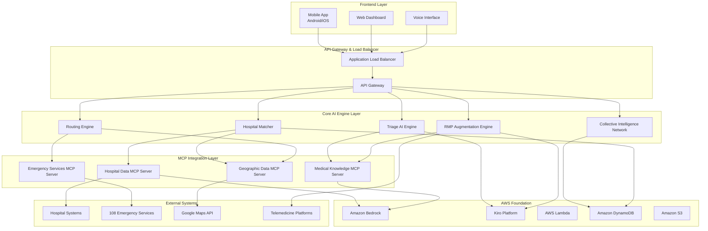

# Design Document

## Overview

The Emergency Medical Triage and Hospital Routing System is a revolutionary AI-powered platform designed to transform India's rural healthcare emergency response by augmenting the capabilities of unqualified Rural Medical Practitioners (RMPs) who handle 68% of rural healthcare cases. The system leverages AWS Bedrock, Kiro Platform, and Model Context Protocol (MCP) to create India's first AI-powered emergency response augmentation platform.

### Key Innovation Areas

1. **Real-Time Medical Augmentation**: AI provides physician-level decision support and procedural guidance during emergencies
2. **Continuous Skill Building**: Personalized medical education that gradually upgrades RMP capabilities over time
3. **Collective Intelligence Network**: Every emergency case improves the system for all 68% of unqualified providers across rural India
4. **Peer-to-Peer Learning**: Creates a virtual medical college connecting isolated RMPs with experienced practitioners
5. **Intelligent Hospital Routing**: Real-time hospital capability tracking with optimal routing recommendations

## Architecture

### High-Level Architecture

The system follows a modular architecture with frontend interfaces, core AI engines, MCP integration layer, and AWS foundation services.



### Role-Based Access Control (RBAC) Architecture

#### Healthcare Worker Module
- **Triage Access**: Full access to triage AI, hospital matching, and routing
- **Training Access**: Personalized learning modules and skill assessments
- **Peer Network**: Connection to collective intelligence and consultation features
- **Patient Management**: Emergency case documentation and handoff reports

#### Hospital Staff Module
- **Capacity Management**: Real-time bed and equipment status updates
- **Incoming Alerts**: Notifications for incoming emergency patients
- **Handoff Reports**: Access to patient triage assessments and transport details
- **Specialist Coordination**: On-call status and availability management

#### Administrator Module
- **System Configuration**: MCP server management and integration settings
- **Analytics Dashboard**: Performance metrics and usage statistics
- **User Management**: RMP registration and competency profile oversight
- **Audit Access**: Complete system audit logs and compliance reporting

### Multi-Component Architecture

#### Component Specialization and Responsibilities

**1. Triage AI Engine**
- **Core Function**: Multi-model ensemble emergency assessment with safety guardrails
- **Capabilities**:
  - Symptom analysis in 7 Indian languages
  - Real-time vital sign interpretation
  - Emergency severity classification (Critical, High, Medium, Low)
  - Medical protocol cross-validation
- **MCP Interfaces**: Medical Knowledge MCP Server, Hospital Data MCP Server

**2. RMP Augmentation Engine**
- **Core Function**: Real-time medical training and decision support for unqualified practitioners
- **Capabilities**:
  - Personalized competency profile management
  - Step-by-step procedural guidance
  - Micro-learning module delivery
  - Telemedicine escalation coordination
- **MCP Interfaces**: Medical Knowledge MCP Server, Telemedicine Platforms

**3. Collective Intelligence Network**
- **Core Function**: Aggregated learning from all RMP interactions across India
- **Capabilities**:
  - Anonymous treatment pattern aggregation
  - Regional disease outbreak detection
  - Peer-to-peer consultation network
  - Protocol updates based on successful outcomes
- **MCP Interfaces**: Hospital Data MCP Server, Analytics Systems

**4. Hospital Matcher**
- **Core Function**: Real-time hospital capability tracking and patient matching
- **Capabilities**:
  - Bed availability monitoring
  - Equipment status tracking
  - Specialist availability queries
  - Multi-factor hospital scoring
- **MCP Interfaces**: Hospital Data MCP Server, Geographic Data MCP Server

**5. Routing Engine**
- **Core Function**: Optimal hospital routing with traffic and condition awareness
- **Capabilities**:
  - Turn-by-turn navigation generation
  - Dynamic route recalculation
  - Alternative hospital recommendations
  - Arrival time estimation
- **MCP Interfaces**: Geographic Data MCP Server, Emergency Services MCP Server

## Components and Interfaces

### Core System Components

#### 1. Authentication and Authorization Service
```typescript
interface AuthenticationService {
  authenticateUser(credentials: UserCredentials): Promise<AuthToken>
  authorizeAccess(token: AuthToken, resource: Resource): Promise<boolean>
  validateRole(userId: string): Promise<UserRole>
  auditAccess(userId: string, action: string, resource: string): void
}

enum UserRole {
  HEALTHCARE_WORKER = "healthcare_worker",
  RMP = "rmp",
  HOSPITAL_STAFF = "hospital_staff",
  ADMIN = "admin",
  DISPATCHER = "dispatcher"
}
```

#### 2. MCP Communication Hub
```typescript
interface MCPHub {
  registerServer(server: MCPServer): Promise<void>
  routeRequest(from: ComponentId, to: MCPServerId, request: MCPRequest): Promise<MCPResponse>
  handleFailover(failedServer: MCPServerId): Promise<void>
  monitorHealth(): Promise<MCPHealthStatus[]>
}

interface MCPRequest {
  id: string
  timestamp: Date
  from: ComponentId
  serverType: MCPServerType
  operation: string
  payload: any
  priority: Priority
  timeout: number
}

enum MCPServerType {
  HOSPITAL_DATA = "hospital_data",
  MEDICAL_KNOWLEDGE = "medical_knowledge",
  GEOGRAPHIC_DATA = "geographic_data",
  EMERGENCY_SERVICES = "emergency_services"
}
```

#### 3. Triage Assessment Interface
```typescript
interface TriageAssessment {
  assessEmergency(input: EmergencyInput): Promise<TriageResult>
  validateAgainstProtocols(assessment: TriageResult): Promise<ValidationResult>
  requestAdditionalInfo(missingData: DataRequirement[]): Promise<AdditionalInfoRequest>
  rankMultiplePatients(patients: TriageResult[]): Promise<PriorityRanking>
  generateTriageReport(result: TriageResult): Promise<TriageReport>
}

interface TriageResult {
  emergencyId: string
  severity: SeverityLevel
  confidence: number
  modelConsensus: ModelConsensusResult
  recommendedActions: Action[]
  flagsForReview: ReviewFlag[]
  safetyDisclaimers: string[]
}

interface ModelConsensusResult {
  modelsUsed: string[]
  individualResults: ModelResult[]
  consensusSeverity: SeverityLevel
  consensusConfidence: number
  disagreements: Disagreement[]
}

enum SeverityLevel {
  CRITICAL = "critical",
  HIGH = "high",
  MEDIUM = "medium",
  LOW = "low"
}
```

#### 4. Hospital Matching Interface
```typescript
interface HospitalMatching {
  getHospitalCapabilities(hospitalId: string): Promise<HospitalCapabilities>
  queryAvailability(requirements: PatientRequirements): Promise<HospitalMatch[]>
  trackRealTimeStatus(hospitalId: string): Promise<RealTimeStatus>
  validateDataFreshness(hospitalId: string): Promise<FreshnessResult>
  matchPatientToHospitals(patient: TriageResult): Promise<HospitalRecommendation[]>
}

interface HospitalCapabilities {
  hospitalId: string
  name: string
  location: Coordinates
  departments: Department[]
  bedAvailability: BedStatus
  equipment: Equipment[]
  specialists: SpecialistAvailability[]
  emergencyCapacity: number
  lastUpdated: Date
}

interface HospitalRecommendation {
  hospital: HospitalCapabilities
  matchScore: number
  matchReasons: string[]
  estimatedArrivalTime: Duration
  alternativeOptions: HospitalCapabilities[]
}
```

#### 5. Routing Engine Interface
```typescript
interface RoutingEngine {
  calculateOptimalRoute(from: Coordinates, to: HospitalId): Promise<Route>
  getAlternativeRoutes(from: Coordinates, requirements: PatientRequirements): Promise<Route[]>
  updateRouteForTraffic(routeId: string): Promise<Route>
  estimateArrivalTime(route: Route): Promise<Duration>
  generateNavigationSteps(route: Route): Promise<NavigationStep[]>
}

interface Route {
  routeId: string
  origin: Coordinates
  destination: HospitalCapabilities
  distance: number
  estimatedDuration: Duration
  trafficConditions: TrafficStatus
  navigationSteps: NavigationStep[]
  alternativeHospitals: HospitalCapabilities[]
}

interface NavigationStep {
  instruction: string
  distance: number
  duration: Duration
  coordinates: Coordinates
  maneuverType: ManeuverType
}
```

#### 6. RMP Augmentation Interface
```typescript
interface RMPAugmentation {
  getCompetencyProfile(rmpId: string): Promise<CompetencyProfile>
  provideRealTimeGuidance(emergencyId: string, rmpId: string): Promise<GuidanceSession>
  deliverMicroLearning(rmpId: string): Promise<LearningModule>
  trackPerformance(rmpId: string, caseOutcome: CaseOutcome): Promise<PerformanceUpdate>
  escalateToTelemedicine(emergencyId: string): Promise<TelemedicineSession>
  getProceduralGuidance(procedure: ProcedureType): Promise<ProceduralGuide>
}

interface CompetencyProfile {
  rmpId: string
  triageAccuracy: number
  proceduralSkills: number
  medicalKnowledge: number
  patientCommunication: number
  casesHandled: number
  currentLevel: CompetencyLevel
  achievements: Achievement[]
  learningProgress: LearningProgress
}

interface GuidanceSession {
  sessionId: string
  emergencyId: string
  rmpId: string
  realTimeEducation: EducationContent[]
  procedureSteps: ProceduralStep[]
  voiceInstructions: AudioGuidance
  visualAids: VisualContent[]
}
```

#### 7. Collective Intelligence Interface
```typescript
interface CollectiveIntelligence {
  aggregateTreatmentPattern(caseOutcome: CaseOutcome): Promise<void>
  detectOutbreakPatterns(region: Region): Promise<OutbreakAlert[]>
  getPeerConsultation(caseId: string): Promise<ConsultationSession>
  updateProtocolFromOutcomes(outcomes: CaseOutcome[]): Promise<ProtocolUpdate>
  getRegionalInsights(region: Region): Promise<RegionalInsight[]>
  shareCase(caseData: AnonymizedCase): Promise<CaseShare>
  getRMPReputation(rmpId: string): Promise<ReputationScore>
}

interface RegionalInsight {
  region: Region
  insightType: InsightType
  description: string
  statistics: StatisticalData
  recommendations: string[]
  confidence: number
}

interface OutbreakAlert {
  alertId: string
  region: Region
  diseasePattern: string
  caseCount: number
  severity: AlertSeverity
  recommendedActions: string[]
  healthAuthorityNotified: boolean
}
```

#### 8. Multi-Language Support Interface
```typescript
interface MultiLanguageSupport {
  translateSymptoms(input: string, sourceLanguage: Language): Promise<TranslatedSymptoms>
  getLocalizedInterface(language: Language): Promise<LocalizedContent>
  generateAudioOutput(text: string, language: Language): Promise<AudioContent>
  simplifyMedicalTerms(terms: MedicalTerm[], language: Language): Promise<SimplifiedExplanation[]>
  processVernacularInput(audio: AudioInput, language: Language): Promise<ProcessedInput>
}

enum Language {
  HINDI = "hi",
  ENGLISH = "en",
  TAMIL = "ta",
  TELUGU = "te",
  BENGALI = "bn",
  MARATHI = "mr",
  GUJARATI = "gu"
}

interface TranslatedSymptoms {
  originalText: string
  sourceLanguage: Language
  translatedText: string
  medicalEntities: MedicalEntity[]
  confidence: number
}
```

## Data Models

### Core Data Structures

#### Emergency Record Data Model
```typescript
interface EmergencyRecord {
  // Identity
  emergencyId: string
  timestamp: Date
  
  // Patient Information
  patientInfo: PatientInfo
  
  // Symptoms and Vitals
  symptoms: SymptomData
  vitalSigns: VitalSigns
  
  // Triage Assessment
  triageAssessment: TriageAssessment
  
  // Routing Information
  hospitalRouting: RoutingDecision
  
  // RMP Information
  assessingRMP: RMPReference
  guidanceProvided: GuidanceRecord[]
  
  // Metadata
  language: Language
  offlineMode: boolean
  syncStatus: SyncStatus
  createdAt: Date
  updatedAt: Date
}

interface PatientInfo {
  age: number
  gender: Gender
  location: Coordinates
  contactInfo?: ContactInfo
  medicalHistory?: string[]
  allergies?: string[]
}

interface SymptomData {
  primarySymptoms: string[]
  secondarySymptoms: string[]
  duration: Duration
  severity: PatientReportedSeverity
  vernacularDescription?: string
}

interface VitalSigns {
  heartRate?: number
  bloodPressure?: BloodPressure
  temperature?: number
  oxygenSaturation?: number
  respiratoryRate?: number
  consciousnessLevel?: ConsciousnessLevel
}
```

#### Hospital Data Model
```typescript
interface HospitalRecord {
  hospitalId: string
  name: string
  type: HospitalType
  
  // Location
  location: Coordinates
  address: Address
  contactInfo: ContactInfo
  
  // Capabilities
  departments: Department[]
  specialists: Specialist[]
  equipment: Equipment[]
  
  // Availability
  bedAvailability: BedAvailability
  emergencyCapacity: EmergencyCapacity
  currentLoad: LoadStatus
  
  // Status
  operationalStatus: OperationalStatus
  lastUpdated: Date
  dataFreshness: FreshnessStatus
  
  // Integration
  apiEndpoint?: string
  integrationStatus: IntegrationStatus
}

interface BedAvailability {
  totalBeds: number
  availableBeds: number
  icuBeds: number
  icuAvailable: number
  emergencyBeds: number
  emergencyAvailable: number
  lastUpdated: Date
}

interface Department {
  name: string
  specialization: Specialization
  available: boolean
  onCallStaff: StaffMember[]
  equipment: Equipment[]
}
```

#### RMP Competency Data Model
```typescript
interface RMPProfile {
  rmpId: string
  
  // Personal Information
  personalInfo: RMPPersonalInfo
  
  // Competency Scores
  competencyScores: CompetencyScores
  
  // Training Progress
  trainingProgress: TrainingProgress
  
  // Performance Metrics
  performanceMetrics: PerformanceMetrics
  
  // Collective Intelligence
  peerNetwork: PeerNetworkStatus
  reputationScore: number
  mentorStatus: MentorStatus
  
  // Metadata
  registeredAt: Date
  lastActive: Date
  preferredLanguage: Language
}

interface CompetencyScores {
  triageAccuracy: number
  proceduralSkills: number
  medicalKnowledge: number
  patientCommunication: number
  overallScore: number
  lastAssessed: Date
}

interface TrainingProgress {
  completedModules: TrainingModule[]
  currentModule?: TrainingModule
  currentLevel: CompetencyLevel
  achievements: Achievement[]
  learningPath: LearningPath
  microLearningCompleted: number
}

interface PerformanceMetrics {
  casesHandled: number
  successfulOutcomes: number
  successRate: number
  averageTriageTime: Duration
  escalationRate: number
  peerRating: number
  patientFeedback: number
}
```

#### Collective Intelligence Data Model
```typescript
interface TreatmentPattern {
  patternId: string
  
  // Case Information
  symptomPattern: string[]
  severityLevel: SeverityLevel
  region: Region
  
  // Outcome Data
  treatmentApproach: string[]
  outcome: OutcomeType
  successRate: number
  caseCount: number
  
  // Metadata
  contributingRMPs: number
  lastUpdated: Date
  confidence: number
}

interface OutbreakPattern {
  patternId: string
  region: Region
  
  // Disease Information
  suspectedCondition: string
  symptomCluster: string[]
  
  // Statistics
  caseCount: number
  timeframe: TimeRange
  growthRate: number
  
  // Alerts
  alertLevel: AlertLevel
  healthAuthorityNotified: boolean
  recommendedActions: string[]
}

interface CaseShareRecord {
  shareId: string
  anonymizedCase: AnonymizedCase
  
  // Consultation
  consultationRequests: ConsultationRequest[]
  responses: ConsultationResponse[]
  
  // Outcome
  finalDiagnosis?: string
  treatmentOutcome?: OutcomeType
  learningsExtracted: string[]
}
```

## Correctness Properties

*A property is a characteristic or behavior that should hold true across all valid executions of a system—essentially, a formal statement about what the system should do. Properties serve as the bridge between human-readable specifications and machine-verifiable correctness guarantees.*

### Property 1: Triage Safety Classification
*For any* emergency assessment, the Triage_AI should classify emergency severity level within 2 minutes AND cross-validate against established medical triage protocols, ensuring patient safety through conservative classification when confidence is low.
**Validates: Requirements 1.1, 1.2, 1.5**

### Property 2: Conservative Safety Default
*For any* triage assessment with confidence scores below 85%, the Triage_AI should recommend "treat as high priority" to ensure patient safety, never under-classifying potentially critical cases.
**Validates: Requirements 1.2, 11.6**

### Property 3: Multi-Model Consensus for Critical Cases
*For any* critical severity classification, the Emergency_Triage_System should provide multiple AI model consensus (minimum 2 models) to reduce single-model bias and hallucination risks.
**Validates: Requirements 1.4, 11.1**

### Property 4: Real-Time Hospital Data Accuracy
*For any* hospital query, the Hospital_Matcher should maintain real-time data on bed availability, equipment status, and specialist availability with results returned within 15 seconds and data freshness validated.
**Validates: Requirements 2.1, 2.2, 2.5**

### Property 5: Intelligent Hospital Routing
*For any* completed patient triage, the Routing_Engine should recommend the top 3 most suitable hospitals within 30 seconds considering patient condition severity, required specializations, hospital capacity, and travel distance.
**Validates: Requirements 3.1, 3.2, 3.3, 3.4**

### Property 6: Dynamic Route Adaptation
*For any* change in traffic, road conditions, or hospital availability, the Routing_Engine should provide alternative hospital recommendations and updated routing within 1 minute.
**Validates: Requirements 3.3, 3.5**

### Property 7: Multi-Language Accessibility
*For any* healthcare worker interaction, the Emergency_Triage_System should support Hindi, English, and 5 major regional languages with accurate symptom translation and audio output for illiterate users.
**Validates: Requirements 4.1, 4.2, 4.3, 4.4, 4.5**

### Property 8: MCP Integration Resilience
*For any* MCP server integration (Hospital Data, Medical Knowledge, Geographic Data, Emergency Services), the Emergency_Triage_System should maintain seamless connectivity and gracefully degrade functionality when connections fail.
**Validates: Requirements 5.1, 5.2, 5.3, 5.4, 5.5**

### Property 9: AWS Service Integration
*For any* AI processing requirement, the system should seamlessly integrate with Amazon Bedrock for foundation models, Kiro Platform for AI orchestration, AWS Lambda for serverless processing, and Amazon DynamoDB for real-time data storage.
**Validates: Requirements 6.1, 6.2, 6.3, 6.4, 6.5**

### Property 10: Data Privacy and Security
*For any* patient data operation, the system should maintain AES-256 encryption at rest and in transit, implement role-based access control, comply with Indian Personal Data Protection regulations, and maintain comprehensive audit logs.
**Validates: Requirements 7.1, 7.2, 7.3, 7.4, 7.5**

### Property 11: Performance Under Load
*For any* system load condition, the Emergency_Triage_System should support 1000+ concurrent emergency assessments without performance degradation, maintaining 99.9% uptime and response times under 2 minutes for triage.
**Validates: Requirements 8.1, 8.2, 8.3, 8.4, 8.5**

### Property 12: Offline Mode Functionality
*For any* connectivity loss, the Emergency_Triage_System should provide offline triage assessment using cached AI models for the 20 most common emergency scenarios with cached hospital data for a 50km radius.
**Validates: Requirements 9.1, 9.2, 9.3, 9.4, 9.5**

### Property 13: Offline Safety Defaults
*For any* offline encounter with complex symptoms not in cached scenarios, the Emergency_Triage_System should default to "HIGH PRIORITY - SEEK IMMEDIATE MEDICAL ATTENTION" and recommend nearest cached hospital.
**Validates: Requirements 9.7**

### Property 14: RMP Real-Time Augmentation
*For any* emergency assessment by an RMP, the Emergency_Triage_System should provide real-time medical education explaining why certain symptoms indicate specific conditions and build personalized competency profiles.
**Validates: Requirements 12.1, 12.2**

### Property 15: Procedural Guidance Delivery
*For any* emergency intervention (CPR, wound care, medication administration), the Emergency_Triage_System should provide step-by-step procedural guidance with voice and visual instructions appropriate to RMP competency level.
**Validates: Requirements 12.3, 12.4**

### Property 16: Telemedicine Escalation
*For any* case exceeding RMP augmented capabilities, the Emergency_Triage_System should connect RMPs with qualified doctors via telemedicine within the escalation protocol timeframe.
**Validates: Requirements 12.5**

### Property 17: Collective Intelligence Aggregation
*For any* successful treatment outcome, the Emergency_Triage_System should anonymously aggregate treatment patterns from all RMPs to improve AI recommendations for similar cases across the network.
**Validates: Requirements 13.1, 13.4**

### Property 18: Outbreak Detection
*For any* regional clustering of emergency cases with similar symptoms, the Emergency_Triage_System should identify disease outbreak patterns and alert health authorities with recommended actions.
**Validates: Requirements 13.2**

### Property 19: Peer Network Facilitation
*For any* RMP seeking consultation, the Emergency_Triage_System should enable peer-to-peer consultation network access where experienced RMPs can provide guidance and virtual medical rounds.
**Validates: Requirements 13.3, 13.6, 13.8**

### Property 20: AI Medical Validation
*For any* AI assessment, the system should implement ensemble learning with multiple AI models, maintain a validated medical knowledge base, and flag assessments deviating from established protocols for human review.
**Validates: Requirements 11.1, 11.2, 11.3**

### Property 21: Healthcare Worker Override
*For any* AI recommendation, healthcare workers should have the ability to override with documented reasoning, and all AI decisions should be logged with reasoning for post-incident medical review.
**Validates: Requirements 11.5, 11.7**

### Property 22: Emergency Services Integration
*For any* emergency response, the system should integrate with 108 emergency ambulance services, share triage assessments with hospital emergency departments, and provide real-time patient status updates.
**Validates: Requirements 10.1, 10.2, 10.3, 10.4, 10.5**

### Property 23: Incomplete Data Handling
*For any* incomplete symptom data submission, the Triage_AI should request specific additional information needed for accurate assessment rather than proceeding with insufficient data.
**Validates: Requirements 1.6**

### Property 24: Multi-Patient Prioritization
*For any* multiple simultaneous patient assessments, the Emergency_Triage_System should rank patients by criticality priority with clear confidence indicators for mass casualty or high-volume scenarios.
**Validates: Requirements 1.7**

### Property 25: Structured Reporting
*For any* completed triage assessment, the Emergency_Triage_System should generate structured triage reports with recommended immediate actions, safety disclaimers, and standardized emergency medical reports for hospital handoff.
**Validates: Requirements 1.8, 10.4**

## Error Handling

### Error Classification and Response Strategy

#### 1. Critical Medical Errors
**Scenarios**: Triage misclassification risk, confidence below threshold, multi-system symptoms
**Response Strategy**:
- Immediate escalation to "treat as high priority" classification
- Flag for human medical professional review
- Multi-model consensus verification for critical cases
- Comprehensive logging for post-incident analysis
- Automatic telemedicine escalation trigger

#### 2. System Integration Errors
**Scenarios**: MCP server failures, AWS service interruptions, hospital API timeouts
**Response Strategy**:
- Graceful degradation to offline capabilities
- Automatic retry mechanisms with exponential backoff
- Fallback to cached data with freshness warnings
- User notification of reduced functionality
- Alternative MCP server routing when available

#### 3. Data Integrity Errors
**Scenarios**: Stale hospital data, inconsistent availability information, corrupted sync data
**Response Strategy**:
- Data freshness validation (flag data older than 30 minutes)
- Automatic data reconciliation on sync
- Quarantine of suspicious data pending verification
- Alert healthcare workers of potential data staleness
- Rollback capabilities for offline sync conflicts

#### 4. Authentication and Authorization Errors
**Scenarios**: Invalid credentials, session timeouts, role permission violations
**Response Strategy**:
- Secure session termination and re-authentication
- Detailed audit logging of all authentication failures
- Temporary account lockout for repeated failures
- Administrative alerts for potential security breaches
- Emergency bypass procedures for critical situations

#### 5. Connectivity and Offline Errors
**Scenarios**: Network loss, poor bandwidth, sync failures
**Response Strategy**:
- Automatic offline mode activation within 5 seconds
- Clear "OFFLINE MODE - LIMITED FUNCTIONALITY" display
- Timestamp of last data update visible to user
- Queue offline assessments for sync when connected
- Maximum 48-hour offline operation limit enforcement

#### 6. AI Model Errors
**Scenarios**: Model disagreement, low confidence outputs, hallucination detection
**Response Strategy**:
- Ensemble voting for consensus decisions
- Conservative classification on model disagreement
- Human review flagging for ambiguous cases
- Model confidence transparency in outputs
- Fallback to rule-based protocols when AI uncertain

### Error Recovery Mechanisms

#### Automatic Recovery
- **Message Queuing**: Reliable delivery with retry for MCP communications
- **Circuit Breakers**: Automatic service isolation for failing components
- **Health Checks**: Continuous monitoring with automatic restart
- **Data Sync**: Automatic reconciliation when connectivity restored
- **Cache Refresh**: Intelligent invalidation and refresh strategies

#### Manual Recovery Procedures
- **Emergency Mode**: Simplified triage flow for system-wide failures
- **Fallback Protocols**: Paper-based backup procedures
- **Escalation Procedures**: Clear paths for technical and medical emergencies
- **Data Recovery**: Point-in-time recovery from encrypted backups
- **Service Restoration**: Step-by-step manual recovery guides

## Testing Strategy

### Dual Testing Approach

The Emergency Medical Triage and Hospital Routing System requires both unit testing and property-based testing to ensure comprehensive coverage of its critical emergency healthcare functionality.

#### Unit Testing Focus
Unit tests validate specific examples, edge cases, and integration points:

**Critical Unit Test Areas**:
- **Triage Edge Cases**: Boundary conditions for severity classification, low confidence scenarios
- **Multi-Language Processing**: Translation accuracy, vernacular symptom interpretation
- **Hospital Matching**: Capability matching logic, availability calculations, distance scoring
- **Offline Mode**: Cache functionality, sync mechanisms, data staleness handling
- **RMP Augmentation**: Competency scoring, learning progression, guidance delivery

**Integration Testing**:
- MCP server connectivity and data retrieval
- AWS Bedrock model integration and ensemble coordination
- Hospital API integration and real-time updates
- 108 emergency services integration
- Geographic and routing service integration

#### Property-Based Testing Configuration

Property tests verify universal correctness across all possible inputs using randomized test generation:

**Configuration Requirements**:
- **Minimum 100 iterations** per property test due to emergency healthcare criticality
- **Extended iteration counts (500+)** for safety-critical properties (triage classification)
- **Comprehensive input generation** covering symptom combinations, vital sign ranges, language variations
- **Regional diversity** in test data generation for Indian healthcare context

**Property Test Implementation**:
Each property test must reference its corresponding design document property using the tag format:
**Feature: emergency-medical-triage, Property {number}: {property_text}**

**Critical Property Test Areas**:
- **Triage Safety Properties**: Conservative classification, confidence thresholds, multi-model consensus
- **Routing Optimization**: Hospital matching accuracy, route calculation, time estimation
- **Multi-Language Accuracy**: Translation consistency across 7 languages, medical term preservation
- **Offline Functionality**: Cache coverage, degraded mode behavior, sync integrity
- **RMP Augmentation**: Competency assessment accuracy, guidance appropriateness, escalation triggers
- **Collective Intelligence**: Pattern aggregation correctness, outbreak detection sensitivity

**Test Data Generation Strategy**:
- **Synthetic Emergency Data**: Realistic symptom combinations, vital sign scenarios, patient demographics
- **Multilingual Test Cases**: Content in Hindi, English, Tamil, Telugu, Bengali, Marathi, Gujarati
- **Regional Variation**: Different healthcare infrastructure, hospital capabilities, geographic conditions
- **Edge Case Generation**: Boundary conditions, rare symptom combinations, system limit testing
- **Load Testing**: Concurrent emergency simulation, high-volume processing, peak usage scenarios

**Healthcare-Specific Testing Considerations**:
- **Medical Accuracy Validation**: Clinical expert review of triage classifications and recommendations
- **Safety Critical Testing**: Extensive testing of conservative classification defaults, escalation triggers
- **Offline Safety Testing**: Verification of safe defaults when cached data is insufficient
- **RMP Competency Testing**: Validation of appropriate guidance delivery based on skill level
- **Cultural Sensitivity Testing**: Verification of appropriate language and communication adaptations

The combination of comprehensive unit testing and extensive property-based testing ensures the system meets the highest standards of reliability, safety, and correctness required for emergency healthcare applications serving India's rural population.
